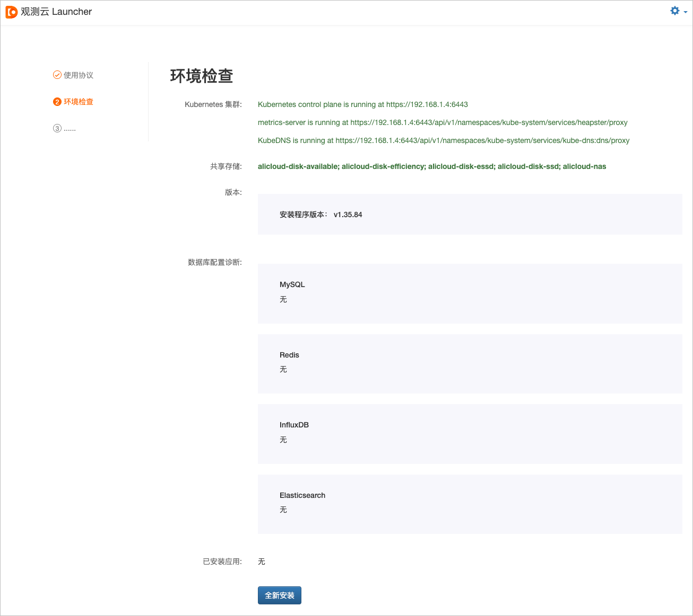
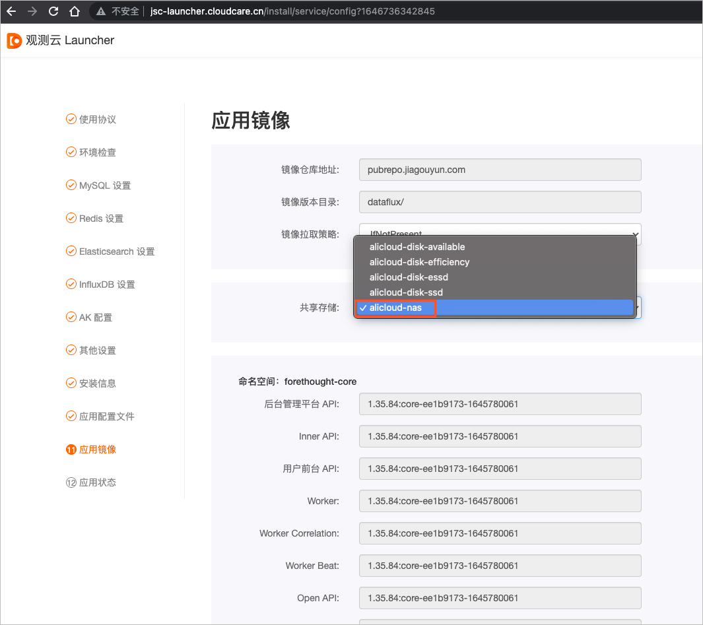

# 一键部署观测云 

## 概述
观测云是⼀个具备可观测性的统⼀实时监测平台，可帮助客⼾快速实现系统可观测，是国内⾸家SaaS化可观测性产品，为客⼾的业务⻓时间在线不中断，提供数据化⼿段的全链路保障服务。本文介绍部署观测云服务实例的详细说明。

## 观测云服务器资源
在部署服务实例前，需要准备如下表所示的服务器资源。

**说明:**

1. 资源清单中用于部署DataWay的两台ECS不在资源编排中，可以在安装部署完成后，自行创建ECS来部署DataWay。
2. 最低配置只适用于POC场景部署，只作为功能验证，不适合作生产环境使用。
3. 推荐配置适合InfluxDB少于15万时间线，Elasticsearch少于70亿⽂档数（⽇志、链路、⽤户访问监测、事件等⽂档数总和）的数据量场景使⽤。
4. 作为生产部署以实际接入数据量做评估，接入的数据量越多，InfluxDB、Elasticsearch的存储与规格配置相应也需要越⾼。

| **资源**        | **规格（最低配置）**       | **规格（推荐配置）**        | **数量** | **备注**               |
|---------------|--------------------|---------------------|--------|----------------------|
| ACK           | 标准托管集群版            | 标准托管集群版             | 1      | 无                    |
| NAS           | 200 G（容量型）         | 200 G（容量型）          | 1      | ACK集群数据持久化           |
| NAT网关         | 小型NAT网关            | 小型NAT网关             | 1      | ACK集群出网使用            |
| SLB           | 性能保障型              | 性能保障型               | 2      | 在Kubenetes Ingress前  |
| ECS           | 4核8 G（单系统盘80 GB）   | 8核16 G（单系统盘120 GB）  | 4      | 部署阿里云ACK托管版集群        |
| ECS           | 2核4 G（单系统盘80 GB）   | 4核8 G（单系统盘120 GB）   | 2      | 部署DataWay            |
| RDS           | 1核2 G 20 GB        | 2核4 G 50 GB（三节点企业版） | 1      | MySQL 5.7            |
| Redis         | 2 G                | 4 G（标准主从版双副本）       | 1      | 版本：4.0               |
| InfluxDB      | 4核16 G 200 GB      | 8核32 G 1 T（集群版）     | 1      | 版本：1.7.x             |
| Elasticsearch | 4核16 G 500 GB（2节点） | 16核64 G 2 T（3节点）    | 1      | 版本：7.4+（推荐7.10）      |
| 云通信           | 无                  | 无                   | 1      | 开通邮件服务               |
| 域名            | 无                  | 无                   | 1      | 主域名需备案，一个主域名名下的8个子域名 |
| SSL证书         | 通配符域名证书            | 通配符域名证书             | 1      | 非必选                  |


## RAM账号所需权限 

观测云服务需要对ECS、CS、SLB等资源进行访问和创建操作，若您使用RAM账号创建服务实例时，需在创建服务实例前，对使用的RAM账号添加相应资源的权限。添加RAM权限的详细操作，请参见[为RAM用户授权](https://help.aliyun.com/document_detail/116146.html)。

| **权限策略名称**                | **备注**                   |
|-------------------------------|--------------------------|
| AliyunCSFullAccess            | 管理容器服务（CS）的权限            |
| AliyunNATGatewayFullAccess    | 管理NAT网关（NAT Gateway）的权限  |
| AliyunNASFullAccess           | 管理文件存储服务（NAS）的权限         |
| AliyunSLBFullAccess           | 管理负载均衡服务（SLB）的权限         |
| AliyunECSFullAccess           | 管理云服务器服务（ECS）的权限         |
| AliyunVPCFullAccess           | 管理专有网络（VPC）的权限           |
| AliyunRDSFullAccess           | 管理云数据库服务（RDS）的权限         |
| AliyunKvstoreFullAccess       | 管理云数据库Redis版（Kvstore）的权限 |
| AliyunHiTSDBFullAccess        | 管理高性能时间序列数据库（TSDB）的权限    |
| AliyunElasticsearchFullAccess | 管理Elasticsearch的权限       |


## 部署流程 

### 部署步骤 

单击[部署链接](https://computenest.console.aliyun.com/user/cn-hangzhou/serviceInstanceCreate?spm=a2c4g.11186623.0.0.42c75ab26JRNoz&ServiceId=service-66e952d5528e43c2a82f)，打开服务实例部署页面，完成部署。

### 部署参数说明 

⽤户在创建观测云服务实例过程中，需要配置服务实例信息，详细的操作步骤请参⻅[创建私有部署服务实例](https://help.aliyun.com/zh/compute-nest/user-guide/create-a-service-instance?spm=a2c4g.11186623.0.i3#task-2101184)。下⾯介绍创建观测云服务实例需要配置的详细参数及注意事项：

    在后续安装Launcher观测云时，需要用到创建服务实例时，设置的主机和中间件的账号密码。因此在创建服务的过程中，需要您记录主机和中间件的账号密码。

* 地域及可用区

  根据实际需要选择部署观测云的地域。例如，可以跟您被监测的应用服务放在同一地域，减少跨地域的数据网络传输。

* 观测云主域名
    配置用于访问部署完成后的观测云的主域名，观测云部署需要用到此主域名下的8个子域名，具体子域名将会在后面的安装引导程序中配置。
        
        后续配置中，以my-guance.com作为示例主域名。

* Kubernetes集群配置
  ⾄少需要4个Kubernetes Worker节点，具体配置，请参考观测云服务器资源。
* ECS跳板机配置
  用于执行部署操作命令的操作机，按量计费，在操作完毕后可以释放。
* 各种数据库中间件配置
  以下为观测云平台依赖的几种数据库中间件，在配置过程中，自行记录各个数据库的账号及密码，在后续安装引导配置时需要使用。
  * MySQL
    按资源清单选择实例规格，一般可选择默认实例规格。实例规格的详细信息，请参见[主实例规格列表](https://help.aliyun.com/zh/rds/product-overview/primary-apsaradb-rds-instance-types?spm=a2c4g.11186623.0.i0#reference-lbw-tyw-5db)。
  * Redis
    按资源清单选择实例规格，不要选择集群版Redis。实例规格的详细信息，请参见[规格查询导航](https://help.aliyun.com/zh/redis/product-overview/overview-4?spm=a2c4g.11186623.0.i1#concept-gph-q34-tdb)。
  * InfluxDB
    按资源清单选择实例规格。
  * Elasticsearch
    按资源清单选择实例规格，实例规格的详细信息，请参见[Elasticsearch实例规格表](https://help.aliyun.com/document_detail/271718.html?spm=a2c4g.11186623.0.0.72da7abauanRRH)。


## 绑定域名 

1. 在本地操作机上的hosts中添加Launcher域名绑定到Kubernetes Ingress的前置SLB公网IP，可以在控制台 **负载均衡** 实例列表页面找到名为Kubernetes.do.not.delete前缀的SLB实例，获取它的公网IP。 建议不要将Launcher安装引导程序的域名解析到公网，只在操作机上进行本机绑定访问即可。hosts中的域名绑定如下。

       ```
       <SLB 公⽹IP> launcher.my-guance.com
       ```

2. 其他所有子系统域名绑定，其他所有需要的默认子域名有（在安装时可以修改默认域名）：
    * dataflux.my-guance.com
    * df-api.my-guance.com
    * df-management.my-guance.com
    * df-management-api.my-guance.com
    * df-func.my-guance.com
    * df-openapi.my-guance.com
    * df-static-res.my-guance.com
    * df-kodo.my-guance.com（此域名不要做公⽹解析）


## 安装观测云 

1. 安装引导
    
    访问http://launcher.my-guance.com，打开安装引导程序页面，根据引导步骤完成安装。安装引导步骤的详细信息，请参见[应用安装引导步骤](https://docs.guance.com/deployment/cloud-deployment-manual/#deploy-steps)。
    
    在安装过程中， **应用镜像** 页面中的 **共享存储** 请选择alicloud-nas。
    

2. 安装完成。


## 后续步骤

观测云产品安装完毕后，您还需要安装一个DataWay数据网关，DataKit才能接入数据。安装DataWay的详细操作，请参见[如何开始使用观测云](https://docs.guance.com/deployment/how-to-start/)。

安装完成后，可以访问以下站点地址：

* 用户前台地址：http://dataflux.my-guance.com
* 管理后台地址：http://df-management.my-guance.com
* func平台：http://df-func.my-guance.com


## 相关文档

* [观测云安装维护手册](https://docs.guance.com/deployment/faq/)
* [观测云使用帮助手册](https://docs.guance.com/)
* [DataKit使用指南](https://docs.guance.com/datakit/)
